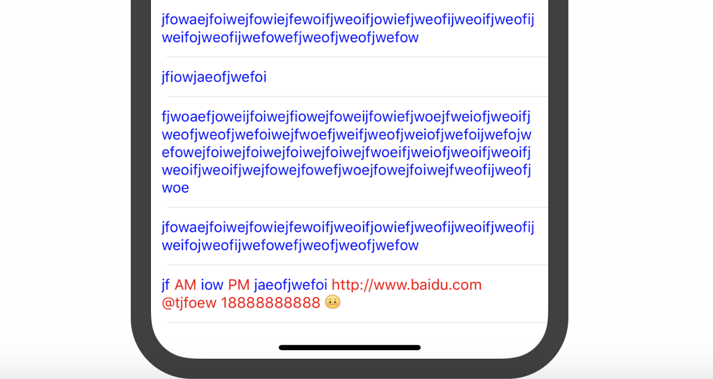

# DZLabel

[](https://cocoapods.org/pods/DZLabel)
[](https://cocoapods.org/pods/DZLabel)
[](https://cocoapods.org/pods/DZLabel)



## Introduction

- Base on UITextView.
- A replacement of UILabel, but more.
- Support for `Mentions`, `Links`, `Phone Numbers`, `Addresses`, `Emoticons(images)`
- Support custom `Regex` links
- Support setting link color
- Support detections of `Sinle-Tap on links`, `Single-Tap on Whole Text`, `Long-Press on links`
- Support automatic table view cell height calculation (autolayout)

## Usage

### 1. Basic Setup
``` swift
var label = DZLabel()
label.font = UIFont.systemFont(ofSize: 14)
label.textColor = UIColor.blue
label.linkColor = UIColor.red
label.text = "test" // do not use .attributedText
```

### 2. Enable Link Types
``` swift
label.enabledTypes = [
    .address,
    .phone,
    .mention,
    .url,
    .emoticon(pattern: nil, // By default: "[EmoticonName]"
              bounds: CGRect(x: 0, y: -2, width: 10, height: 10), // Position and Size
              imageNameBlock: ({ name in // Text -> Local Image Name
                var imageName = name
                if imageName.hasPrefix("[") { imageName.removeFirst() }
                if imageName.hasSuffix("]") { imageName.removeLast() }
                return imageName})),
    .regex(pattern: "AM|PM"),
]
```

### 3. Handle Callbacks
``` swift
label.handleMentionTap { result in
    print("mention tapped" + result)
}

label.handleURLTap { result in
    print("url tapped" + result)
}

label.handlePhoneTap { result in
    print("phone tapped" + result)
}

label.handleAddressTap { result in
    print("address tapped" + result)
}

label.handleKeywordLongPress {
    print("keyword long pressed")
}

label.handleRegexKeywordTap { result in
    print("custom regex tapped" + result)
}
```

## Example

To run the example project, clone the repo, and run `pod install` from the Example directory first.

## Requirements
- iOS 8+
- Swift 4

## Installation

DZLabel is available through [CocoaPods](https://cocoapods.org). To install
it, simply add the following line to your Podfile:

```ruby
pod 'DZLabel'
```

## Author

Darren Zheng, 623767307@qq.com

## License

DZLabel is available under the MIT license. See the LICENSE file for more info.
